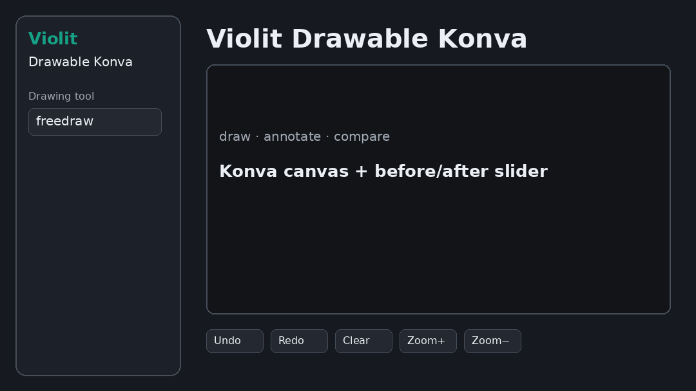

# Violit Drawable Konva



Violit widget wrapping the same Konva canvas used by
[`streamlit-drawable-konva`](https://github.com/gsiogkas/streamlit-drawable-konva)
(**0.3.0** tracks Streamlit **0.6.x** standalone).

Requires **Violit ≥ 0.8.29** (`app.register_js_widget`).

## Features

- `vl_canvas` — drawable Konva canvas (same tools as `st_canvas`)
- **In-canvas tool picker** — `tools=[…]` + `display_tool_picker=True`
- `vl_image_comparison` — before/after slider companion (same as `st_image_comparison`)
- Background color / image (upload or sample)
- Scene `json_data` with coordinates (`x`/`y`/`width`/`height`/`points`)
- Spline helpers: `splines_from_json`, `sample_spline`, …

Demo uses **dark** theme. Pass Violit `State` / callables into `vl_canvas`
(not `.value`) so drawing mode and stroke update live. With
`display_tool_picker=True`, tools can also be switched on the canvas itself.

## Install (editable)

```bash
cd /devel/dev/cvrlab/violit-drawable-konva
uv venv .venv
source .venv/bin/activate
uv pip install -e ".[dev]"
```

Sync the browser IIFE from the Streamlit sibling build (required before demo / packaging):

```bash
# ensure standalone.js exists in streamlit-drawable-konva first
bash scripts/sync_standalone.sh
```

Until you sync, the package falls back to:

`../streamlit-drawable-konva/streamlit_drawable_konva/frontend/build/standalone.js`

## Demo

```bash
source .venv/bin/activate
.venv/bin/violit run demo/app.py --reload --localhost --port 8031
# → http://localhost:8031
```

`demo/app.py` must end with `app.run()` (Violit does not auto-start the server).

## Tests

```bash
pytest -q
```

## Usage

```python
import violit as vl
from violit_drawable_konva import ensure_registered, vl_canvas, vl_image_comparison

app = vl.App(title="Canvas", theme="dark")
ensure_registered(app)  # optional; also called by vl_canvas / vl_image_comparison

drawing_mode = app.state("polygon", key="drawing_mode")
stroke_width = app.state(3, key="stroke_width")
stroke_color = app.state("#111", key="stroke_color")
bg_file = app.state(None, key="bg_file")
payload = app.state({"image_data_url": None, "json_data": None}, key="c1")

app.file_uploader("Background", type=[".png", ".jpg"], bind=bg_file)

result = vl_canvas(
    app,
    drawing_mode=drawing_mode,  # State, not .value
    stroke_width=stroke_width,
    stroke_color=stroke_color,
    background_image=bg_file,   # UploadedFile / PIL / State / callable
    height=400,
    width=600,
    tools=["freedraw", "line", "rect", "polygon", "transform", "pan"],
    display_tool_picker=True,
    key="c1",
    bind=payload,
)
# result.json_data / result.image_data

vl_image_comparison(app, img_before, img_after, width=600, key="cmp")
```

Helpers mirror the Streamlit package: `crop_box_from_json`, `objects_by_group`,
`splines_from_json`, `spline_control_points`, `sample_spline`, `sample_catmull_rom`.

## Layout

```
violit_drawable_konva/
  api.py                # ensure_registered, vl_canvas, vl_image_comparison
  payload.py / spline.py / helpers.py
  static/standalone.js  # synced IIFE (mount + mountImageComparison)
demo/app.py
tests/
scripts/sync_standalone.sh
```

## Publish (PyPI)

```bash
cd /devel/dev/cvrlab/violit-drawable-konva

# 1) Sync JS from Streamlit build (after streamlit 0.6.x is built)
bash scripts/sync_standalone.sh

# 2) Tests
.venv/bin/python -m pytest -q

# 3) Commit & push
git add -A
git status
git commit -m "Release 0.3.0: in-canvas tool picker and tools allow-list."
git push -u origin main
git tag v0.3.0 && git push origin v0.3.0

# 4) Build & publish
uv build
uv publish   # needs UV_PUBLISH_TOKEN or interactive PyPI token
```

Verify: https://pypi.org/project/violit-drawable-konva/

Bump `version` in `pyproject.toml` before each new upload (PyPI versions are immutable).

### Quick PyPI update (0.2.0 → 0.3.0)

```bash
bash scripts/sync_standalone.sh
uv build && uv publish
pip install -U violit-drawable-konva   # expect 0.3.0
```

## Manual port checklist

1. Build Streamlit frontend (`npm run build`) so `standalone.js` exists.
2. `bash scripts/sync_standalone.sh`
3. `uv pip install -e ".[dev]"` (`violit>=0.8.29`)
4. `pytest -q`
5. `violit run demo/app.py --reload --localhost --port 8031`
6. Commit / tag / `uv publish` (see above)
